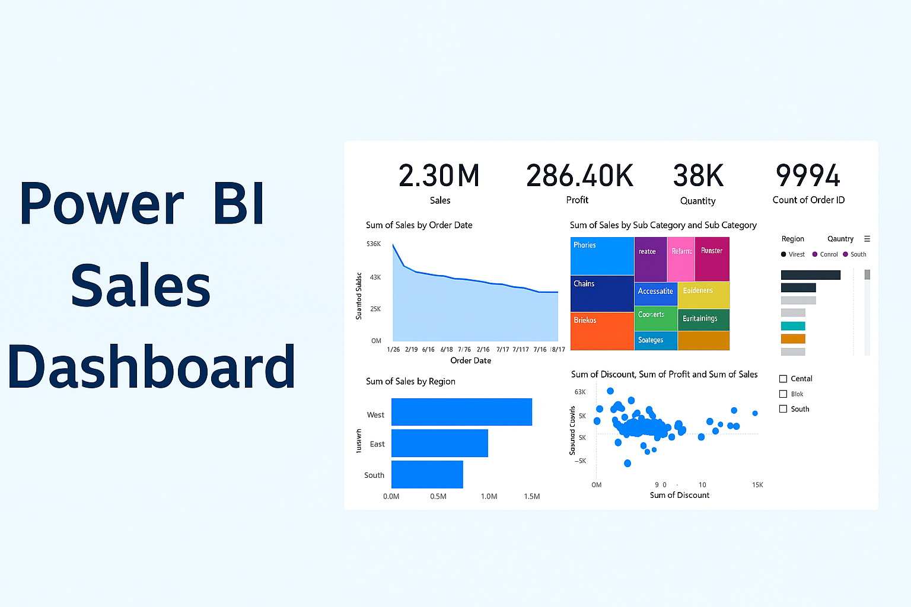

# 📊 Power BI Sales Dashboard

This project is a Power BI dashboard that provides insights into sales, profit, quantity, and order trends using the Superstore Dataset. It was built using Power BI Desktop to help businesses monitor and analyze their performance efficiently.

---

## 🔍 Key Visuals

- 📅 **Sales Over Time** – Tracks sales performance across different order dates.
- 🌍 **Sales by Region** – Regional contribution to overall sales and profit.
- 📦 **Sales by Category/Sub-Category** – Breakdown of product performance.
- 📉 **Profit vs Discount Scatterplot** – Visualizing discount impact on profit.
- 👥 **Customer-Level Analysis** – Top customers and potential losses.

---

## 📸 Dashboard Screenshot

---

## 📁 Files Included

| File                  | Description                           |
|-----------------------|---------------------------------------|
| `PowerBI_Dashboard.pbix` | Main Power BI dashboard file         |
| `cover.png`           | Cover image for GitHub repository     |
| `screenshot.png`      | Preview of the dashboard UI           |
| `README.md`           | Project documentation (this file)     |

---

## 🛠 Tools Used

- Microsoft Power BI Desktop
- Superstore Sales Dataset (Sample)
- GitHub for version control and sharing

---

## 🧠 Insights Uncovered

- Western region yields highest profit but not highest sales.
- Technology category has the highest average profit per order.
- Excessive discounts lead to losses in several product sub-categories.

---

## 🌟 Author

**Your Name**  
📧 reddysu81@gmail.com  
🔗 [https://github.com/gitwithsunil]
